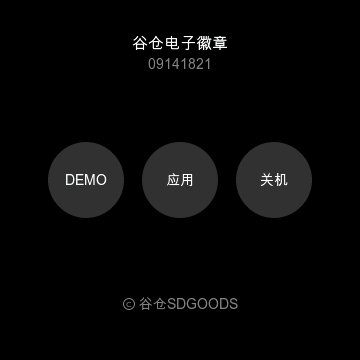
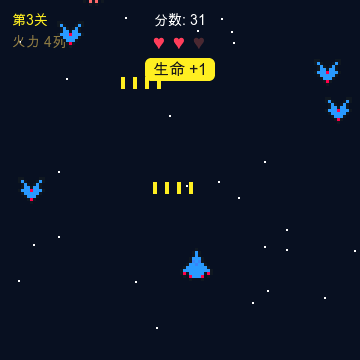

[](README.md) [](README_EN.md)

# 谷仓次元屏 · SDGOODS-ESP32S3

[](https://github.com/SDGOODS/SDGOODS-ESP32S3/actions/workflows/build.yml)
[](LICENSE)
[](LICENSING.md)

> [!IMPORTANT]
> 本工程是谷仓次元屏（谷仓电子徽章）设备的二次开发基础工程，
> 著作权及相关权利归 **深圳希德创新网络有限公司（SDGOODS）** 所有。
> 代码按本仓库许可自由使用，但 **项目名、产品名与 SDGOODS 标识不在代码许可授权范围内**（见 [TRADEMARK.md](TRADEMARK.md)）。
> 官网 [https://sdgoods.ai](https://sdgoods.ai) · 邮箱 `zhangzuoliang321@126.com`。

这是一块 **ESP32-S3 + 360×360 圆形触摸屏** 设备的完整固件示例工程：开机动画 → 主页 → DEMO和示例。
还包含从零手写的 UI 框架与游戏逻辑，以及一套串口一键截屏调试链路等。
参考这份代码，你能轻松使用 AI 在谷仓次元屏（谷仓电子徽章）上进行二次开发。

| 主页 | 应用启动台 |
|---|---|
|  |  |

---

## 硬件能力

谷仓次元屏（谷仓电子徽章）的板载硬件：

| 部件 | 型号 / 规格 |
|---|---|
| 主控 SoC | ESP32-S3-R8（双核 Xtensa LX7，内置 **8MB Octal PSRAM**） |
| 存储 | **32MB Flash**（QSPI） |
| 显示屏 | 圆形 **360×360**，**ST77916** 驱动，QSPI 接口，RGB565 |
| 触摸 | **CST816** 电容触摸（与屏一体，I2C，支持滑动手势） |
| 惯性传感 | **QMI8658** 六轴 IMU（3 轴加速度计 + 3 轴陀螺仪，I2C） |
| 音频输出 | 板载 Class-D 功放 + 喇叭（I2S） |
| 音频输入 | 数字麦克风（I2S） |
| 物理按键 | 1 颗电源键（GPIO6） |
| 电池 | **500mAh** 锂电池 + 电池检测 / 供电管理（GPIO7） |
| 无线 | 2.4GHz **WiFi** + **Bluetooth 5（BLE）**，支持双人蓝牙联机对战 |
| 接口 | USB（USB-Serial-JTAG，用于烧录 / 调试 / 串口截屏） |

**外观与佩戴**：圆形机身，直径 **58mm**、厚度 **9mm**；背面带**磁吸**，可吸附在金属表面；另设**挂绳孔**与**别针**（badge pin）两种佩戴方式，可作胸牌 / 挂饰。

所有引脚与面板参数只在 [`components/sdgoods_board/include/board_pins.h`](components/sdgoods_board/include/board_pins.h) 定义，应用层不得复制这些常量。

---

## DEMO 与参考应用

固件里预置了几个 demo，既用来直观展示这块屏「能做什么」，也是给 AI 当参考模板的现成代码。下面**不是硬件全量清单**（全量见上方「硬件能力」），而是挑几个代表性 demo，看代码怎么用硬件；每一行也标了它适合给 AI 当模板参考什么：

| Demo / 参考文件 | 演示的硬件能力 | 给 AI 当模板参考什么 |
|---|---|---|
| 主页 / 应用启动台（`ui_home.c`） | 圆形 360×360 触摸屏、电容触摸滑动手势、开机动画 | 外壳 / 启动台写法 |
| 演示页（`ui_demo_page.c`） | 基础 UI 控件、双语文案、屏与触摸的综合调用 | 页面布局、控件与硬件调用的写法 |
| 小鸟（`ui_flappy.c`） | 触摸控制 + 定时器游戏循环 + 音频播放 | 简单游戏：触摸输入 + 定时刷新 + 绘制 |
| 飞机大战（`ui_plane.c` + `plane_net.c`） | 触摸 / 陀螺仪操控，以及 **WiFi + BLE 双人蓝牙联机对战** | 完整游戏 + 双人蓝牙联机同步逻辑 |
| 最小骨架（`main/apps/app_template.c`） | 最小可运行应用（用 `tools/new_app.py` 一键生成） | **新应用从这里改**：改它就成新应用 |
| 串口一键截屏 | 连电脑即抓当前画面（调试链路） | — |

> AI 读完这些参考 + [`AGENTS.md`](AGENTS.md) + [`docs/ARCHITECTURE.md`](docs/ARCHITECTURE.md)，
> 能快速实现你想要的应用。

---

## 🚀 用一句话开始开发

想给谷仓次元屏做一个新应用？把需求直接交给 **AI 编程助手** 即可——它会先跑 `tools/check_env.py` 检查环境，再按本仓库规范开发。

```
请读取 https://github.com/SDGOODS/SDGOODS-ESP32S3 的代码和文档，
为谷仓次元屏开发一个 <你的应用> 应用。
使用触摸操控，界面文案使用中英双语。
遵守 AGENTS.md 与 docs/ARCHITECTURE.md；
完成运行实现与测试，
并给报告和建议。
```

需求越具体越容易一次实现正确：用户流程、按键/手势做什么、是否掉电保存、体验目标、验收标准。
若细节没给全，AI 可在不改变产品方向的前提下采用保守默认值，但需在交付里列出假设。

> ★ 本 README 只描述产品与仓库。**AI 开始开发前请先读 `AGENTS.md`**——那里是编译方式、两层边界、字体流程与几条「不遵守就出 bug」的硬约束。

---

## 🤖 AI 辅助开发工具包

除了 [`AGENTS.md`](AGENTS.md) 这份「AI 必读规范」，仓库还附带一套 **AI 辅助开发工具包** [`sdgoods-ai/`](sdgoods-ai/README.md)：6 个跨平台 Skill（封装环境检查 / 新建应用 / 编译烧录 / 截屏 / 字体 / 提交固件，支持 WorkBuddy / Claude Code / Cursor）+ 一个领域 Agent 定义 + 一个**本地 MCP server 实现**（纯标准库，把「提交固件」走通成「AI 开发 → 一键上传到开放平台」闭环）+ 各平台 MCP 配置样例。

- **装上即用**：`bash sdgoods-ai/install.sh` 把 Skill 装到 WorkBuddy，AI 在涉及本设备开发时自动调用。
- **优先 MCP、回退 CLI**：提交固件优先走开放平台 MCP；未连 MCP 时回退到 `tools/sdgoods_publish.py`（邮箱验证码登录，凭据只存本机）。
- **安全**：开放平台不开源，本仓库只含客户端配置样例与协议说明，**不含 server 代码与任何密钥**。

详见 [`sdgoods-ai/README.md`](sdgoods-ai/README.md)。

---

## 提交到谷仓 SDGOODS 开放平台

做出来的固件可以提交到 **谷仓 SDGOODS 开放平台**（开发者上传、他人下载 / 烧录的广场）。三种方式任选，详见 [`docs/PUBLISHING.md`](docs/PUBLISHING.md)：

1. **网页手动**：平台上传固件，填信息、传截图（可点「从设备截图」连真机抓图）、传 `.bin`。
2. **命令行 / AI 助手**：`python3 tools/sdgoods_publish.py login 邮箱` 一次，`publish` 即可交——纯标准库，AI 也能直接调用。
3. **让 AI 直调 REST API**：照 `docs/PUBLISHING.md` 的 curl 示例（鉴权 → presign 直传 → 创建记录）。

> 网页「从设备截图」会先发 `?` 探测固件能力（`SDGOODS-CAPS:SHOT`），**无截屏能力的固件会弹窗提示**
> 「请让 AI 在 BSP 中启用截屏能力（`CONFIG_SDGOODS_SCREENSHOT`）后重烧」，而不是盲抓出颜色错乱的图。

---

## 项目结构

```
components/sdgoods_board/   # 平台层（Apache-2.0，可商用）：驱动/LVGL/触摸/音频/外壳/字体
  └── include/board_pins.h  # 引脚定义（换板子改这里）
main/apps/                  # 应用层（Apache-2.0，二次开发主要在这里）
  ├── apps_registry.c       # 应用清单（启动台显示什么、谁被轮询）
  ├── app_template.c        # 新应用模板
  ├── ui_home.c  ui_app_page.c  ui_about.c
  ├── ui_flappy.c           # 小鸟
  └── ui_plane.c  plane_net.c  # 飞机大战 + 双人蓝牙联机
tools/                      # 脚手架与调试脚本（Apache-2.0）
  ├── new_app.py            # 一条命令生成新应用并自动接线
  ├── check_env.py          # 开发环境检查（AI 第一步必跑）
  ├── gen_fonts.py          # 重新生成中文子集字体
  ├── font_metrics.py       # 离线核对文字宽度
  ├── screenshot_recv.py    # 电脑端接收串口截屏
  └── sdgoods_publish.py    # 命令行提交固件到开放平台
docs/                       # BUILD / ARCHITECTURE / ENVIRONMENT / PUBLISHING
AGENTS.md                   # ★ AI 编程助手必读入口
LICENSING.md  TRADEMARK.md  NOTICE  LICENSE
```

---

## 文档索引

| 文档 | 内容 |
|---|---|
| [`AGENTS.md`](AGENTS.md) | ★ AI 改代码的编译方式、两层边界、硬约束、提交前检查清单 |
| [`docs/ENVIRONMENT.md`](docs/ENVIRONMENT.md) | 开发环境要求与安装（Python / ESP-IDF / esptool） |
| [`docs/BUILD.md`](docs/BUILD.md) | 编译 / 烧录 / 打包分发 |
| [`docs/ARCHITECTURE.md`](docs/ARCHITECTURE.md) | 分层设计、钩子机制、联机同步、调试链路 |
| [`docs/PUBLISHING.md`](docs/PUBLISHING.md) | 提交固件到开放平台（网页 / CLI / API） |
| [`LICENSING.md`](LICENSING.md) | 授权范围 / 商业授权申请 / 什么算商业用途（FAQ） |
| [`TRADEMARK.md`](TRADEMARK.md) | SDGOODS 标识与商标使用规范 |
| [`NOTICE`](NOTICE) | 第三方组件与归属声明 |

---

## 许可证（简要）

本工程（平台层与应用层）**统一以 Apache-2.0 发布**：商业与非商业均免费，可闭源、可修改、可再分发。
许可只授权代码，**不含商标**（见 [TRADEMARK.md](TRADEMARK.md)）。

| 部分 | 许可证 | 商业使用 |
|---|---|---|
| `components/sdgoods_board/`（平台层） | Apache-2.0 | ✅ 免费 |
| `main/`（应用层） | Apache-2.0 | ✅ 免费 |
| `tools/`（脚本） | Apache-2.0 | ✅ 免费 |
| `main/patches/`（LVGL 补丁） | MIT | ✅ 免费（LVGL 原许可） |
| `components/sdgoods_board/fonts/`（子集字体） | SIL OFL 1.1 | ✅ 免费（字体原许可） |

授权范围与商标使用见 [LICENSING.md](LICENSING.md) / [TRADEMARK.md](TRADEMARK.md)。

---

## 联系

- **官网**：[https://sdgoods.ai](https://sdgoods.ai)（谷仓 SDGOODS 开放平台）
- **邮箱**：`zhangzuoliang321@126.com` —— 商业授权、报 bug、合作都走这个邮箱

---

## 致谢

- [LVGL](https://lvgl.io/) · [ESP-IDF](https://github.com/espressif/esp-idf) · [Noto Sans SC](https://github.com/notofonts/noto-cjk) · [gifdec](https://github.com/lecram/gifdec)
