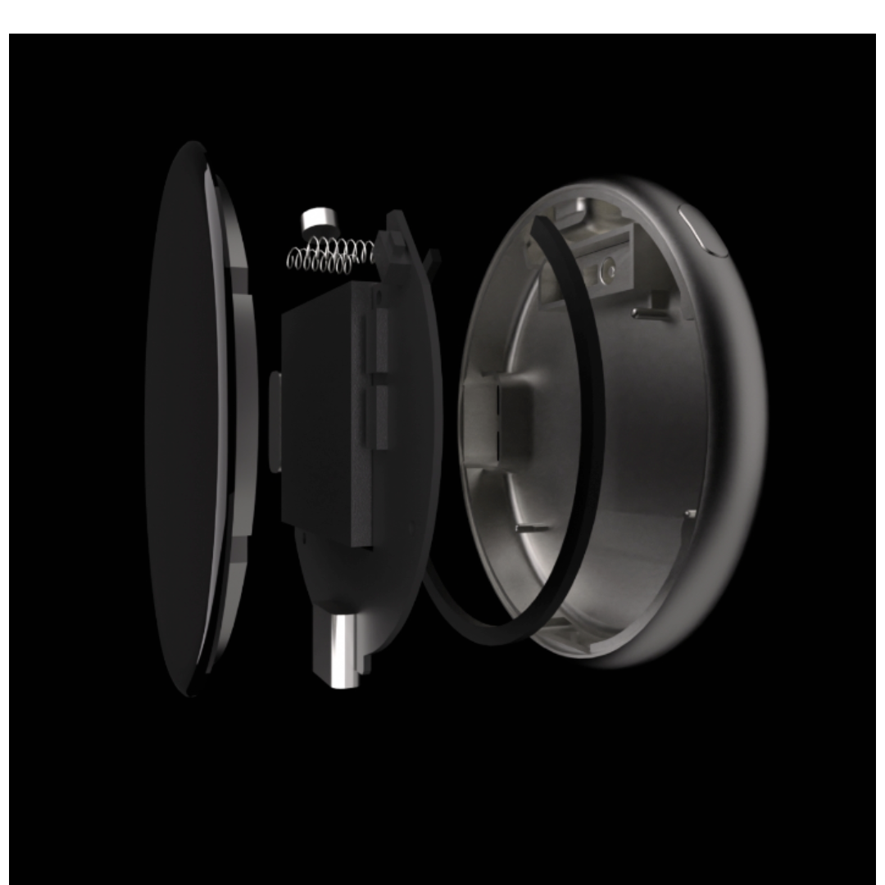
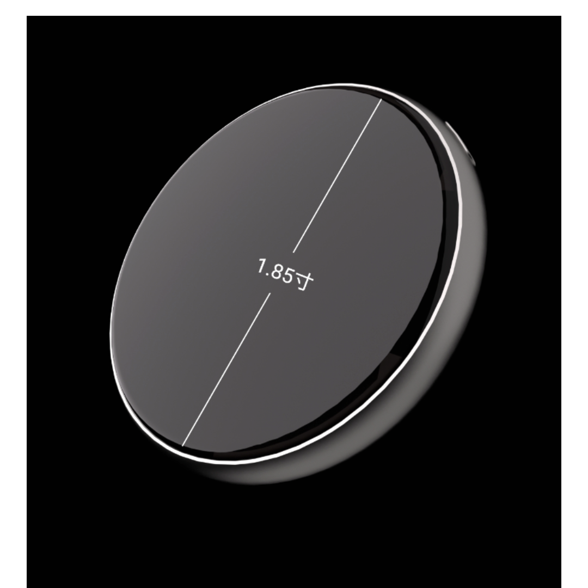
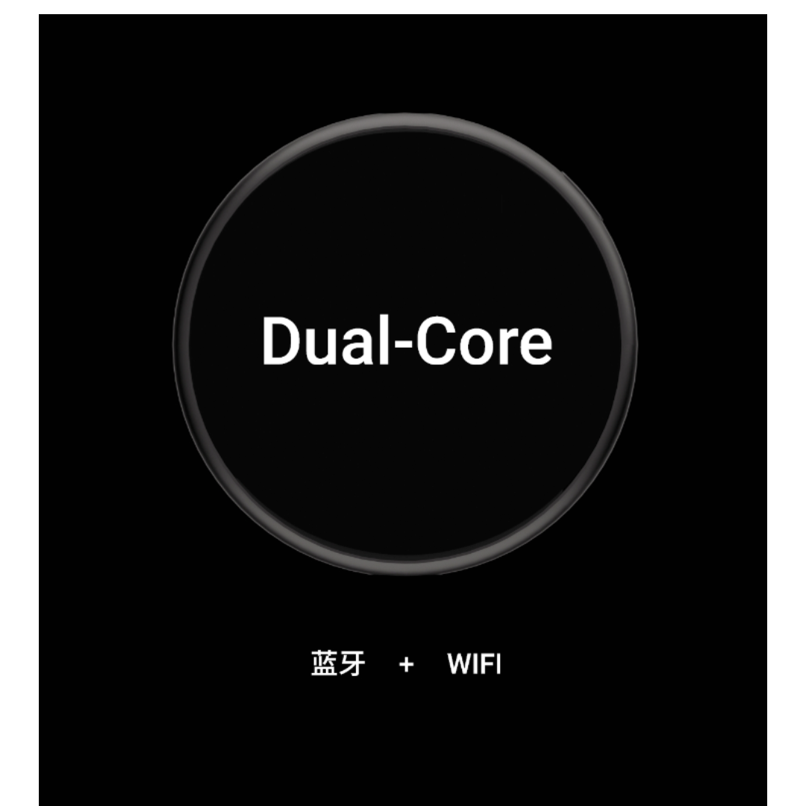
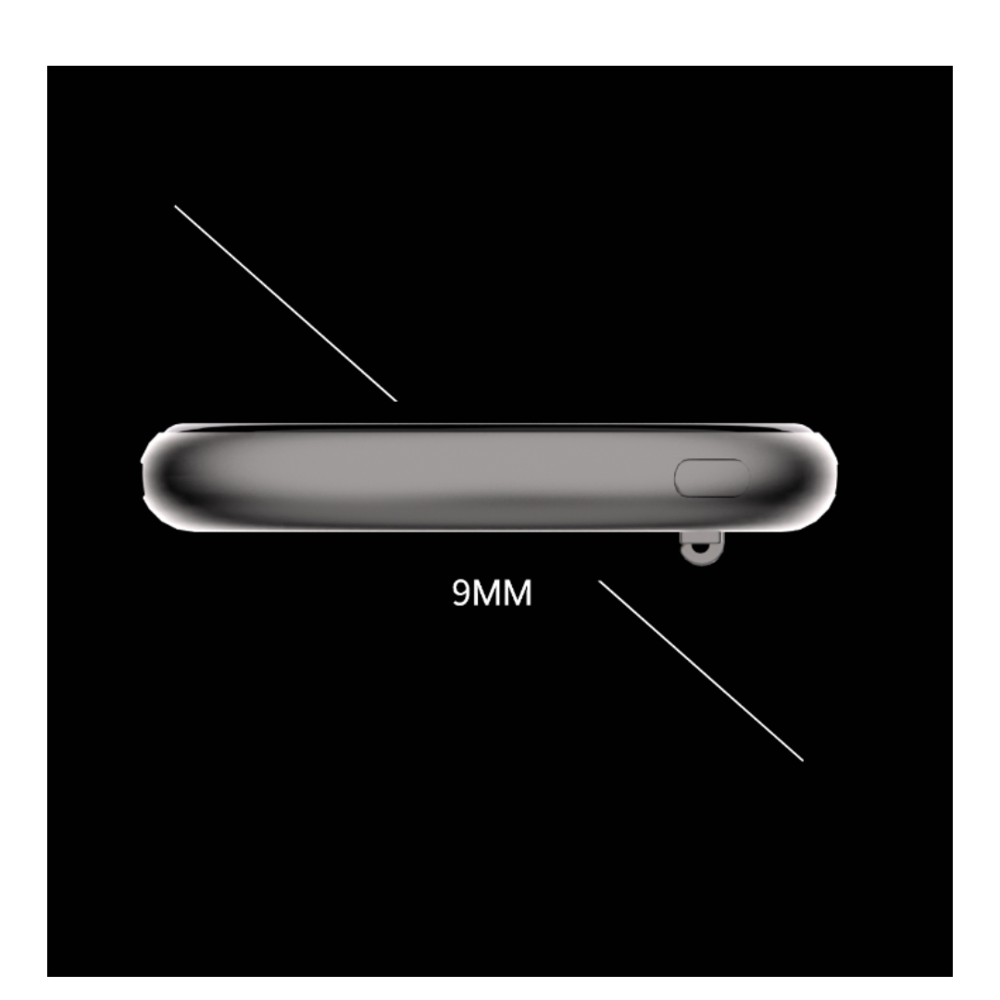
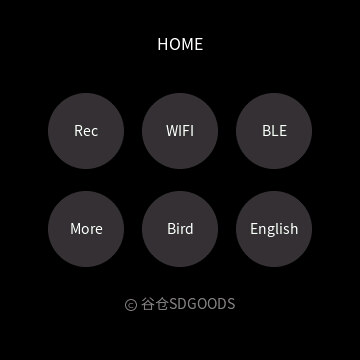
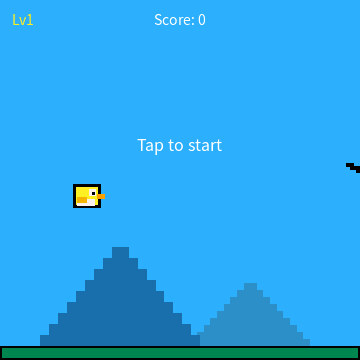
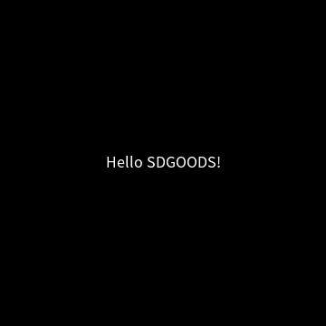
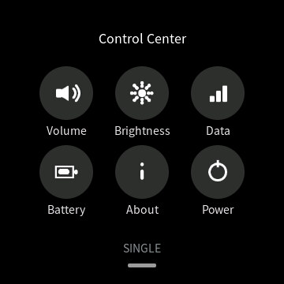

[](README.md) [](README_EN.md)

# SDGOODS Electronic Badge · SDGOODS-ESP32S3

[](https://github.com/SDGOODS/SDGOODS-ESP32S3/actions/workflows/build.yml)
[](LICENSE)
[](LICENSING.md)

> [!IMPORTANT]
> This repository is the base project for second development on the **SDGOODS Electronic Badge** device.
> Copyright and related rights belong to **Shenzhen Seed Innovation Network Co., Ltd. (SDGOODS)**.
> The code is freely usable under this repository's license, but the **project name, product name, and SDGOODS marks are NOT covered by the code license** (see [TRADEMARK.md](TRADEMARK.md)).
> Website [https://sdgoods.ai](https://sdgoods.ai) · Email `zhangzuoliang321@126.com`.

---

## Project Goal

> **Enable anyone — through the AI coding assistant they already use — to go from cloning this repo on GitHub → deriving their own app → developing it → publishing it to the SDGOODS Open Platform, all within 5 minutes, without first becoming an embedded expert.**

This repository is designed to be "**AI-readable, AI-editable, AI-publishable**":

- **AI can read it**: `AGENTS.md` is the must-read spec before an AI touches the code; `docs/` contains complete layered-architecture, build, publishing, and SDK documentation; `sdgoods-ai/` is a one-command-installable AI development toolkit (Skills + Agent + local MCP server).
- **AI can edit it**: the repo ships a hand-written UI framework and several samples (Flappy game / home launcher / scan & recognize demo pages) — both a showcase of what the board can do and ready-made templates for AI to modify.
- **AI can ship it**: the bundled publishing pipeline closes the loop "develop → package → upload to the SDGOODS Open Platform" into one command / one MCP call.

Just hand your requirement to your AI assistant in plain language; it will build the app following this repo's specs and help you publish it.

---

## SDGOODS Electronic Badge (Hardware)

An **ESP32-S3 + 360×360 round touch screen** wearable badge that can be worn as a name tag / pendant. On-board hardware:

| Part | Model / Spec |
|---|---|
| SoC | ESP32-S3-R8 (dual-core Xtensa LX7, **8MB Octal PSRAM** on-chip) |
| Storage | **32MB Flash** (QSPI) |
| Display | Round **360×360**, **ST77916** driver, QSPI, RGB565 |
| Touch | **CST816** capacitive touch (I2C, gesture support) |
| Motion | **QMI8658** 6-axis IMU (3-axis accelerometer + 3-axis gyroscope, I2C) |
| Audio out | Class-D amplifier + speaker (I2S) |
| Audio in | Digital microphone (I2S) |
| Physical key | 1 power key (GPIO6) |
| Battery | **500mAh** Li-ion + battery gauge / power management (GPIO7) |
| Wireless | 2.4GHz **WiFi** + **Bluetooth 5 (BLE)**, supports 2-player Bluetooth battles |
| Interface | USB (USB-Serial-JTAG, for flashing / debug / serial screenshots) |

**Appearance & wearing**: round body, **58mm** diameter, **9mm** thick; **magnet** on the back for metal surfaces; plus a **lanyard hole** and a **badge pin**.

| Front · 1.85-inch round screen | Side · 9mm slim body (with lanyard hole) |
|---|---|
|  |  |
| **Dual-core · Bluetooth + WiFi** | **Internal structure (exploded view)** |
|  |  |

> Why these specs matter: the 360×360 **circle** clips the corners — all UI must fit inside the round-screen safe rectangle (the platform provides `SDG_UI_SAFE_X/Y/W/H` grid constants); 8MB PSRAM fits full LVGL frame buffers and fairly large image assets. The app layer must **not** copy pin constants from `components/sdgoods_board/include/board_pins.h`.

### On-device preview (samples shipped in this repo: Home + Flappy bird, single-player)

| Home | Flappy bird |
|---|---|
|  |  |

---

## What Is the SDGOODS Open Platform?

The [SDGOODS Open Platform](https://sdgoods.ai) is the **app market / plaza** for this badge:

- **For developers**: upload your compiled app firmware (a single `.bin`), fill in name / description / category / screenshots, submit for **review**, and once approved it goes **live** — other users can find it and install it on their badges.
- **For end users** (badge owners): browse apps, one-click download, and flash to their badge via Web Serial or platform tools; one badge supports **multiple app slots** with free switching.
- **For AI / CI**: the platform provides an **MCP developer interface** (just a `sdg_` developer token), so your AI assistant can push finished firmware straight to the platform — no manual form filling.

Key rules every developer must know:

- **You only upload a "pure app image"**: the platform automatically prepends the official bootloader (bootloader / partition table), so your `.bin` carries **no flash addresses** and no factory partitions.
- **Review**: submissions enter a review queue and go public once approved; any app should only ever have **one** record on the platform (re-publishing = delete the old record, then create the new one).
- **Multi-app vs single-app**: the same `app.bin` can be listed as one app of the "multi-app mode" launcher, or flashed as a "single-app mode" standalone firmware — determined at runtime by the device, no dual builds needed (see `docs/SINGLE_APP_FIRMWARE.md`).

---

## 🚀 From Zero to the Store: Four Steps

Each of the four steps below offers two routes — **the results are identical; pick one and follow it**:

- **👤 Non-developer**: no command line. You only need an AI coding assistant (WorkBuddy / Claude Code / Cursor — any one); tell it what you want in plain words and it does the work.
- **💻 Developer**: comfortable with the terminal; just run the commands.

---

> [!IMPORTANT]
> **First step before any development: connect the "SDGOODS Electronic Badge" to your computer with a *data-capable* Type-C cable.**
> Do this *before* writing any code or asking the AI to start — only with the device connected can the AI flash firmware, capture serial screenshots, and verify on real hardware for you.
> Once connected, just follow the AI through the four steps below.

## Step 1 · Set Up the Environment

**👤 Non-developer**

All you need: a computer (macOS / Windows / Linux), a **data-capable Type-C cable** (a plain charging cable may only supply power, not transfer data — pick one that can transfer files to a PC), and an AI coding assistant. Send this to the AI:

```
First clone this repository: https://github.com/SDGOODS/SDGOODS-ESP32S3
Then follow docs/ENVIRONMENT.md inside it
to check and set up the development environment on this computer.
Install whatever is missing, tell me what you're doing at each step,
then run an environment check and summarize the results.
```

The AI will check and install Python, the ESP-IDF toolchain and USB drivers, then hand you an environment report. Just confirm any "allow" pop-ups along the way.

**💻 Developer**

```bash
git clone https://github.com/SDGOODS/SDGOODS-ESP32S3
cd SDGOODS-ESP32S3
python3 tools/check_env.py     # checks Python / ESP-IDF / esptool; tells you what's missing
bash sdgoods-ai/install.sh     # optional: install the AI toolkit so assistants auto-apply this repo's specs
```

Version requirements and manual installation: [docs/ENVIRONMENT.md](docs/ENVIRONMENT.md).

---

## Step 2 · Generate Your First App

**👤 Non-developer**

**Run the minimal example first (recommended)** — send this to the AI:

```
First clone this repository: https://github.com/SDGOODS/SDGOODS-ESP32S3
Then follow the README and AGENTS.md specs inside it.
Use tools/new_app_project.py to generate a standalone app project named HelloApp,
change the on-screen greeting to Hello SDGOODS!, build it, flash it to the connected
SDGOODS Electronic Badge, and screenshot the device for me.
```

What you get is a **minimal app**: `Hello SDGOODS!` in the center of the round screen. On-device result:

| First app · real device | Pull down from the top · control center (built into the template, zero code) |
|---|---|
|  |  |

Seeing the left screen means you have completed the whole chain — **generate → build → flash → verify on hardware** (well under 10 minutes). The control center on the right ships with the platform template — volume, brightness, screenshot, and the About page all work out of the box; your app gets them for free.

**💻 Developer**

```bash
git clone https://github.com/SDGOODS/SDGOODS-ESP32S3
cd SDGOODS-ESP32S3
python3 tools/new_app_project.py MyApp   # derive a standalone app project, created one level up at ../MYAPP/
cd ../MYAPP                              # enter the new project (critical: build inside it, not in the repo)
idf.py set-target esp32s3
idf.py -B build build                    # build
```

The derived `MYAPP/` (sibling of this repo) is a **fully buildable, standalone project that boots straight into your app**: no home screen, no launcher, no demos — power on and you are in your UI.

> ★ This README covers product & workflow only. **An AI must read `AGENTS.md` before touching the code** — that's where the build commands, the two-layer boundary, the font pipeline, and several "break-the-bug" hard constraints live.

---

## Your First App Can Already Do All This

The minimal app generated by `new_app_project.py` comes from `app_template.c` in this repo — **not an empty shell**, but already wired to every standard platform capability:

| Capability | What it means | Where you change it |
|---|---|---|
| **Boots straight into your app** | No home / launcher / demos; power on → your UI | `ui_<name>.c` |
| **Round-screen safe area** | Built-in `SDG_UI_SAFE_X/Y/W/H` grid; widgets never get clipped by the round edge | Reference the constants in layout |
| **Touch interaction** | Tap buttons, tap anywhere, swipe-left-to-go-back — all via proven platform primitives (no hand-written gesture detection) | `sdgoods_app_on_tap` / `sdgoods_app_on_gesture` |
| **Top pull-down menu** | Pull down from the top for the control center: volume ± / brightness / screenshot / exit | Provided automatically by the platform layer |
| **Control center / About page** | Volume, brightness, device info (incl. firmware version) — zero code from you | Provided automatically by the platform layer |
| **Platform sound effects** | Call `sdgoods_audio_sfx_flap()` to play a cue sound, safe with no side effects | In your event callbacks |
| **Bilingual strings** | Write `SDG_T("中文", "English")`; users can switch language in settings | All UI strings |
| **One-key serial screenshot** | Connect to a computer and capture the current screen (for debugging and store screenshots) | `tools/screenshot_recv.py` |
| **Per-frame loop** | `ui_<name>_poll()` runs every frame for animation / game logic | Your `poll` function |
| **Lifecycle** | pause (frozen when the menu overlays) / resume / exit (cleanup) callbacks | The corresponding callbacks |
| **Persistent storage** | Store data via the `appdata` partition (already reserved) | `APP_SDK.md` |

> ⚠️ **The one rule you must never forget**: any **new Chinese text** in the UI requires re-running the font subset tool, otherwise those characters render as boxes (tofu):
> ```bash
> python3 tools/fetch_fonts.py   # first time only: download the OFL source fonts
> python3 tools/gen_fonts.py
> ```

---

## Step 3 · Modify Your First App

**👤 Non-developer**

**Start your first modification with one line of text** — send this to the AI:

```
Change "Hello SDGOODS!" on the HelloApp home screen to "Hello, World!",
rebuild, flash to the device, and screenshot it for me.
```

The text on screen changes — that's the whole experience of modifying an app: **say what you want in plain words; the AI edits the code, builds, flashes, and shows you a screenshot**.

**Then turn it into the app you want** — still just send the requirement to the AI:

```
Please turn HelloApp into <your app, e.g. a countdown timer / step counter / mini game>.
Requirements: <describe in plain words what it should do, what taps/gestures do, whether data is saved>.
Use bilingual (Chinese/English) UI strings. Build, flash to the device, and screenshot it for me.
```

The more specific the requirement, the more likely it is right the first time. The AI finds the right files (all UI lives in `main/apps/ui_<name>.c`), edits and rebuilds; add "**flash it and take a screenshot so I can see**" to every change and you'll watch the real device update on your screen.

Curious about the generated code? Ask the AI "walk me through this app's code and teach me how to change it" — it will explain piece by piece.

**💻 Developer**

- UI and logic live in `main/apps/ui_<name>.c` of the derived project: `ui_<name>_start` builds the UI, `ui_<name>_poll` runs every frame, touch goes through the platform callbacks (`sdgoods_app_on_tap` / `sdgoods_app_on_gesture`).
- Platform capability APIs (touch primitives / sound / bilingual strings / persistent storage): [docs/APP_SDK.md](docs/APP_SDK.md).
- Build / flash / serial screenshot commands: [docs/BUILD.md](docs/BUILD.md).
- ⚠️ Added new Chinese strings? Re-run the font subset tool above, or the new characters render as boxes.

---

## Step 4 · Publish Your First App

Once development is done and verified on hardware, you're ready to publish. Two official paths — **the results are identical; pick one**.

**👤 Non-developer**

**Let the AI publish for you (recommended)** — send this to the AI:

```
Please publish HelloApp to the SDGOODS Open Platform for me.
I'll generate a developer token starting with sdg_ in the platform's developer
settings and paste it to you; you take care of packaging the firmware, filling in
the name / description / category, attaching screenshots, and submitting it for
review. Report the result back to me when done.
```

The AI will first guide you to generate a `sdg_` developer token in the platform's developer settings (paste it to the AI once), then automatically package → upload → fill in name / description / screenshots → submit for review. Once approved, it's live.

**Publish on the web yourself**: first tell the AI "package HelloApp into an uploadable app.bin for me", then open [sdgoods.ai](https://sdgoods.ai) → upload the packaged `dist/<name>_app.bin` → fill in name / description / category → upload screenshots (or click "Capture from device" to grab a real-device shot) → submit for review.

**💻 Developer (MCP token push, ideal for AI / CI)**

1. Generate a `sdg_` developer token in the developer settings of the SDGOODS Open Platform.
2. Package the pure app image (the platform auto-prepends the bootloader):
   ```bash
   idf.py -B build build
   python3 tools/pack_app.py -b build      # produces dist/<name>_app.bin
   ```
3. Save the developer token (once), then push with the token (your AI can also call the MCP server directly):
   ```bash
   # Save the token (or temporarily: export SDGOODS_DEV_TOKEN="sdg_your_token")
   python3 tools/sdgoods_publish.py set-token "sdg_your_token"

   python3 tools/sdgoods_publish.py mcp-upload \
     --file dist/<name>_app.bin \
     --name "MyApp" --category tool \
     --desc-zh "..." --desc-en "..." \
     --shots shot1.jpg shot2.jpg shot3.jpg shot4.jpg
   ```
   The submission enters review and goes live once approved. When re-publishing, run `mcp-replace <old_id>` first to delete the old record, then upload.

Other token-channel subcommands: `mcp-firmwares` (list your own submissions), `mcp-unpublish` (delist), `mcp-delete` (delete draft/rejected records), `mcp-download <id> --check-sha256 <local sha256>` (fetch the platform's flash manifest for an anti-brick check). See `python3 tools/sdgoods_publish.py --help` and [docs/PUBLISHING.md](docs/PUBLISHING.md).

> The web's "Capture from device" first sends `?` to probe firmware capabilities (`SDGOODS-CAPS:SHOT`); **firmware without screenshot support gets a prompt to enable `CONFIG_SDGOODS_SCREENSHOT` in the BSP and reflash**, instead of blindly grabbing a color-scrambled image.

---

## 🤖 How AI Should Read This Repo

Besides `AGENTS.md` (the must-read spec), the repo ships an **AI development toolkit** [`sdgoods-ai/`](sdgoods-ai/README.md): 8 cross-platform Skills (env check / new app / build & flash / screenshot / fonts / config / crash & memory triage / publishing, supporting WorkBuddy / Claude Code / Cursor) + one domain Agent definition + a **local MCP server implementation** (pure standard library; closes the loop "AI develops → one-click upload to the open platform") + MCP config samples for each platform.

- **Install and go**: `bash sdgoods-ai/install.sh` installs the Skills into WorkBuddy; the AI invokes them automatically whenever this device is involved.
- **Safe by design**: the open platform itself is not open source; this repo contains only client-side config samples and protocol docs — **no server code and no secrets**.

---

## Project Structure

```
components/sdgoods_board/   # Platform layer (Apache-2.0, commercial use OK): drivers/LVGL/touch/audio/shell/fonts
  └── include/board_pins.h  # Pin definitions (change here for a different board)
main/apps/                  # App layer (Apache-2.0 — where most second development happens)
  ├── apps_registry.c       # App registry (what the home screen shows, who gets polled)
  ├── app_template.c        # New-app template (copied by new_app_project.py)
  ├── ui_home.c             # Home screen (single-app first screen)
  ├── ui_scan_page.c  ui_rec_page.c  ui_other_page.c   # Sample pages
  └── ui_flappy.c           # Flappy bird (game demo)
tools/                      # Scaffolding & debug scripts (Apache-2.0)
  ├── new_app_project.py    # Derive a standalone app project from scratch (boots straight in, listed independently)
  ├── check_env.py          # Dev environment check (always the AI's first step)
  ├── gen_fonts.py          # Regenerate the Chinese subset fonts
  ├── screenshot_recv.py    # PC-side serial screenshot receiver
  ├── pack_app.py           # Package a pure app image (for publishing)
  └── sdgoods_publish.py    # CLI / MCP firmware submission to the open platform
platform/                   # ★ Platform-managed layer: do not modify, do not commit changes
  ├── partitions.csv        # Multi-app partition table (overwritten by the official one at install time)
  └── prebuilt/             # Prebuilt bootloader for local debugging
docs/                       # BUILD / ARCHITECTURE / ENVIRONMENT / PUBLISHING / APP_SDK ...
AGENTS.md                   # ★ Must-read entry for AI coding assistants
LICENSING.md  TRADEMARK.md  NOTICE  LICENSE
```

---

## Documentation Index

| Doc | Content |
|---|---|
| [`AGENTS.md`](AGENTS.md) | ★ Build commands, two-layer boundary, hard constraints, pre-commit checklist for AI |
| [`docs/ENVIRONMENT.md`](docs/ENVIRONMENT.md) | Dev environment requirements & setup (Python / ESP-IDF / esptool) |
| [`docs/BUILD.md`](docs/BUILD.md) | Build / flash / package & distribute |
| [`docs/ARCHITECTURE.md`](docs/ARCHITECTURE.md) | Layered design, hooks, multiplayer sync, debug pipeline |
| [`docs/APP_SDK.md`](docs/APP_SDK.md) | App-side SDK and multi/single-app mode detection |
| [`docs/SINGLE_APP_FIRMWARE.md`](docs/SINGLE_APP_FIRMWARE.md) | Run your app as the host firmware (single-app mode) |
| [`docs/STANDALONE_PROJECT.md`](docs/STANDALONE_PROJECT.md) | Full standalone-project refactor (manual trim, no derive) |
| [`docs/MULTI_APP_DYNAMIC_SLOTS.md`](docs/MULTI_APP_DYNAMIC_SLOTS.md) | Multi-app slots, slot addresses & cover-block layout |
| [`docs/PUBLISHING.md`](docs/PUBLISHING.md) | Submitting firmware to the open platform (web / CLI / MCP) |
| [`docs/MCP_CONTRACT.md`](docs/MCP_CONTRACT.md) | MCP / publishing field contract (local stdio server vs platform-hosted MCP) |
| [`LICENSING.md`](LICENSING.md) | Licensing scope / commercial licensing / FAQ |
| [`TRADEMARK.md`](TRADEMARK.md) | SDGOODS marks & trademark rules |
| [`NOTICE`](NOTICE) | Third-party components & attribution |

---

## License (Summary)

This project (platform layer and app layer) is released under **Apache-2.0**: free for commercial and non-commercial use, closed-source derivatives allowed, modification and redistribution allowed. The license covers the code only — **not the trademarks** (see [TRADEMARK.md](TRADEMARK.md)).

| Part | License | Commercial use |
|---|---|---|
| `components/sdgoods_board/` (platform layer) | Apache-2.0 | ✅ Free |
| `main/` (app layer) | Apache-2.0 | ✅ Free |
| `tools/` (scripts) | Apache-2.0 | ✅ Free |
| `main/patches/` (LVGL patches) | MIT | ✅ Free (upstream LVGL license) |
| `components/sdgoods_board/fonts/` (subset fonts) | SIL OFL 1.1 | ✅ Free (upstream font license) |

---

## Contact

- **Website / Open Platform**: [https://sdgoods.ai](https://sdgoods.ai)
- **Email**: `zhangzuoliang321@126.com` — commercial licensing, bug reports, partnerships

---

## Acknowledgements

- [LVGL](https://lvgl.io/) · [ESP-IDF](https://github.com/espressif/esp-idf) · [Noto Sans SC](https://github.com/notofonts/noto-cjk) · [Source Han Sans](https://github.com/adobe-fonts/source-han-sans) · [gifdec](https://github.com/lecram/gifdec)
